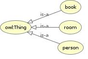
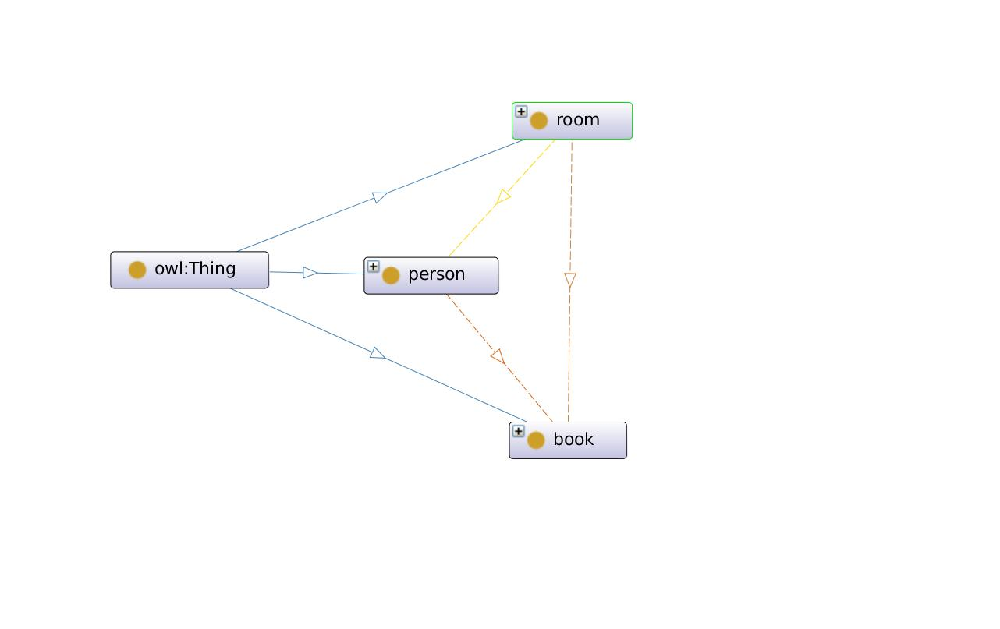
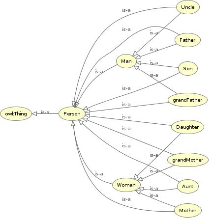
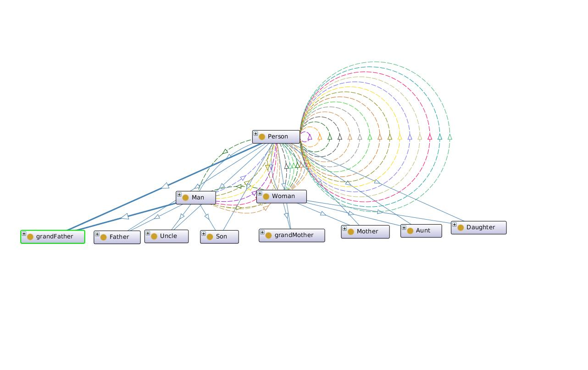
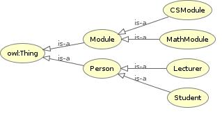
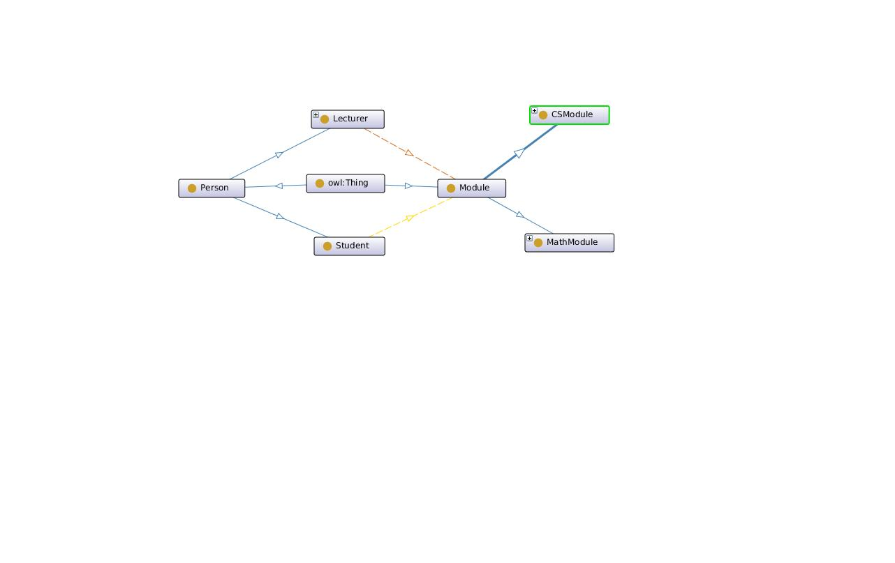

# OWL_Ontologies

## Robot Task Example Ontology
A simple example where robot has to identify who has the object based on the information about the location

#### OWLViz Graph

#### OntoGraf View

## Family Ontology
Used SWRL Rules to make ontology more robust.

#### OWLViz Graph

#### OntoGraf View

## University Ontology
Baisc examples of Ontologies developed in OWL.

#### OWLViz Graph

#### OntoGraf View

